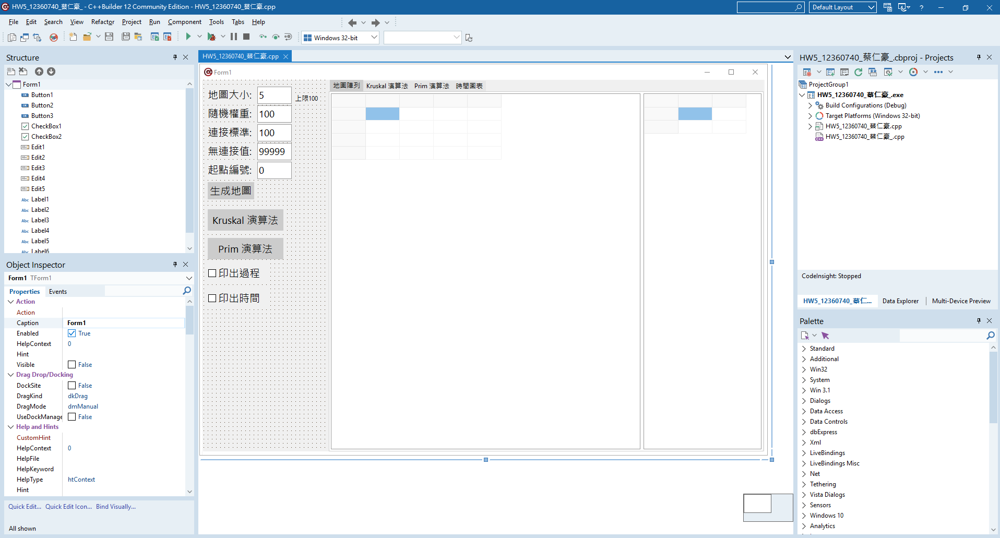
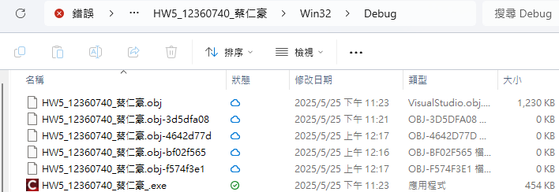
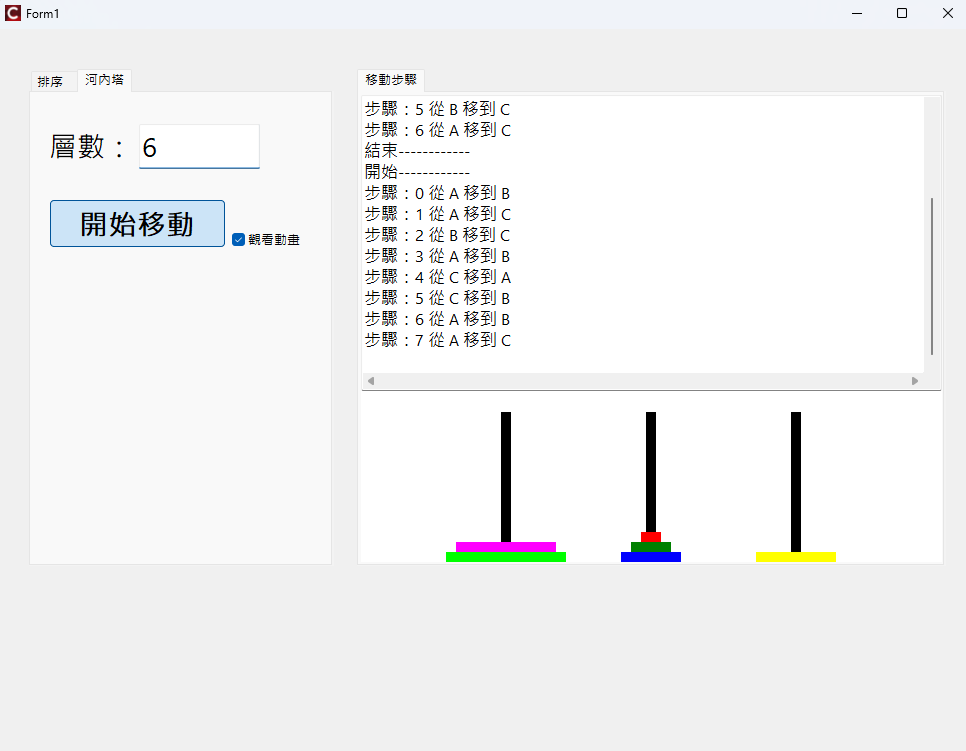
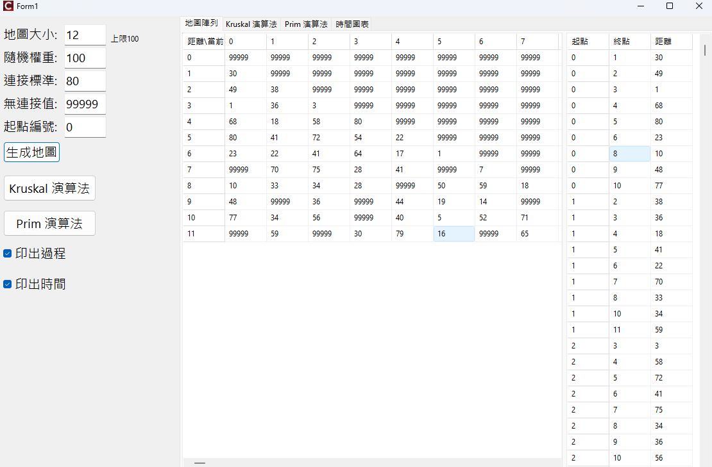
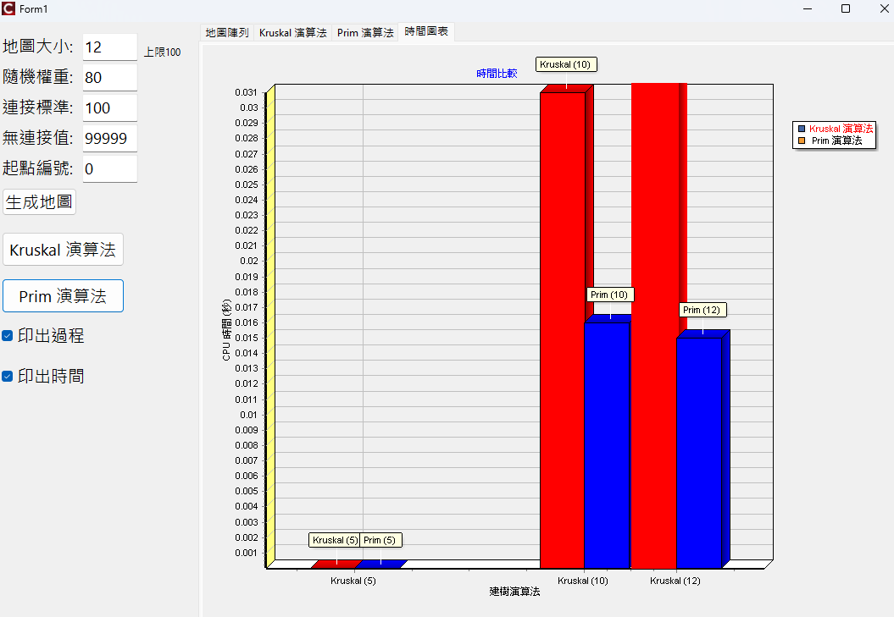

# c--builder
學校課程(資料結構/演算法)的 C++ builder 作業檔案

## 1.開啟方法
下載 C++ builder ，打開 [檔案.cbproj] 即可使用介面。整體介面很像之前用 VScode社群版 做 C# 應用的樣子，可以使用上方綠色按鈕執行建置

建置過的，可以到 Win32/Debug 找exe檔案直接執行(如果沒安裝 C++ builder好像沒法跑?)

這裡是一些執行後的畫面

